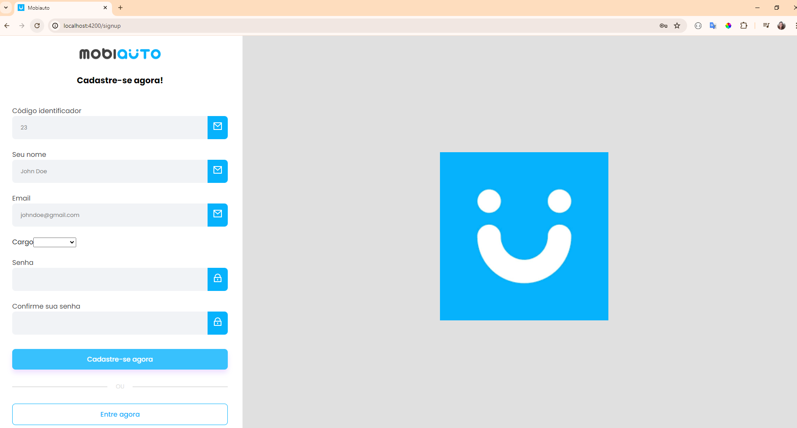
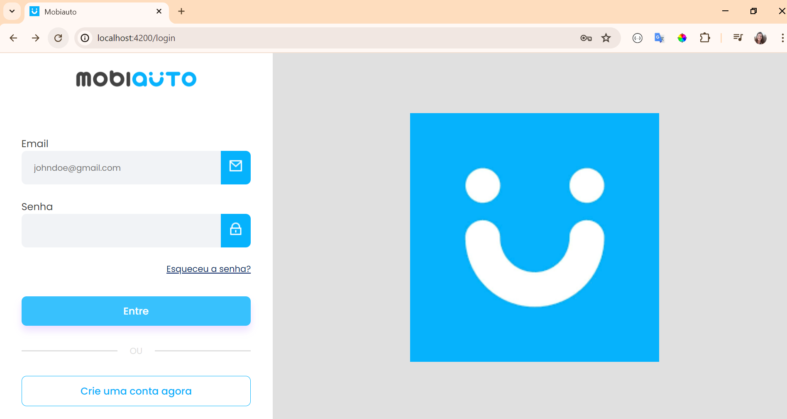
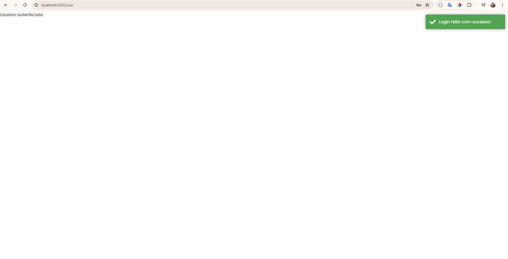
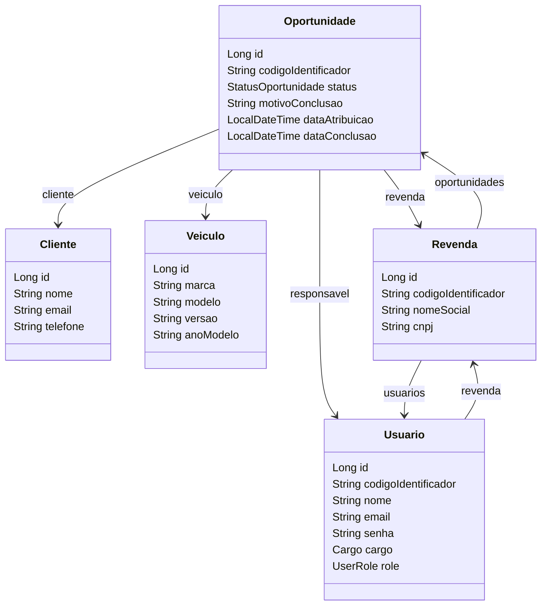

# mobiauto-backend-interview
Teste técnico Mobiauto
# Informações Gerais
Criei um front-end em angular para consumir a api do projeto, o front-end encontra-se no repositório
https://github.com/angelapaganucci/login-page. 
Para rodar o front-end é necessário ter o node instalado na máquina, após clonar o repositório, 
acessar a pasta do projeto e rodar o comando npm install para instalar as dependências do 
projeto e após isso rodar o comando ng serve para subir o servidor localmente.
Com esse front, é possivel criar um usuario e depois de criado logar com esse usuario.

## 1. Introdução:
* O sistema Mobiauto tem como objetivo fornecer uma poderosa ferramenta de gestão de Revendas
de veículos
## 2. Visão Geral:
### Para esse software foram utilizadas as seguintes tecnologias:
* Java 17
* Maven
* Springboot
* Spring security
* Lombok
* Spring jpa
* Spring jwt
* Banco de dados foi utilizado o H2 e para acessar o console desse banco as informações com url, ususario e senha encontra-se no application.yml do projeto
## Diagrama de classes

## 3. Suporte e Contato:
* Dúvidas entre em contato no e-mail angelapaganucci@hotmail.com
